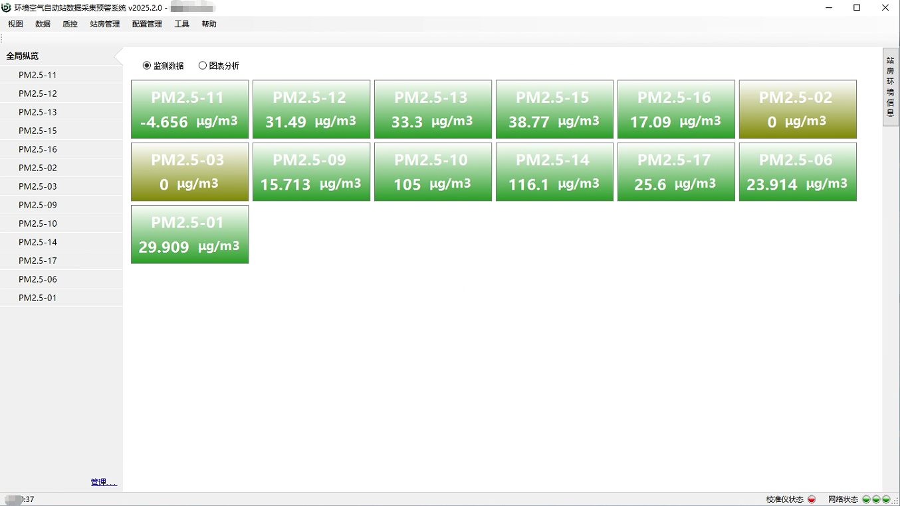

# 在线监测数据采集软件

> 面向环境在线监测系统的数据采集、设备通信与协议解析软件
> 支持多仪器接入、统一协议抽象、实时数据采集与存储

---

## 📌 项目简介

本项目用于 **环境在线监测系统**，实现对多种现场仪器的数据采集、协议解析与统一管理。

**特点：**
- 🧠 **软件 / 仪器 / 协议 解耦设计**：架构清晰，便于维护和扩展。
- 🔌 **支持多种通信方式**：TCP / UDP / 串口 (RS232/RS485) / Modbus (TCP/RTU) / 自定义协议。
- 📊 **实时数据采集、缓存与上报**：保证数据连续性与可靠性。
- 🛠 **适用于多种仪器**：VOC、气体分析仪、离子色谱等在线监测设备。

---

## 🧩 系统总体架构

**架构说明：**
- **采集服务层**：负责与物理设备的连接、通信管理和原始数据读取。
- **协议解析层**：通过可插拔的协议适配器，解析不同厂商、不同格式的数据报文。
- **数据处理层**：对解析后的数据进行校验、缓存、结构化处理和统一存储。
- **应用服务层**：提供数据展示、报警管理、报表生成及向上级平台的数据上报接口。

---

## 🖥 软件展示

### 主控制台

### 实时数据监控面板

---

## 🔌 支持的仪器（示例）

**目前已适配的仪器类型包括：**
- **NDIR 非分光红外气体分析仪**（如用于 CO2、CH4 监测）
- **VOC 在线监测设备**（PID/FID 原理）
- **离子色谱（IC）**
- **水质多参数分析仪**（pH、COD、氨氮等）
- **基于嵌入式模块（如 ESP32、工业 PLC）的定制采集终端**

---

## 📡 通信方式与协议

### 支持的通信方式
- **网络通信**：TCP Client/Server，UDP
- **串行通信**：RS-232，RS-485（支持多种波特率、数据位、停止位配置）
- **工业协议**：Modbus TCP，Modbus RTU
- **自定义协议**：支持基于二进制或文本格式的定制化协议解析。

### 协议抽象层设计

**设计优势：**
- **统一的协议适配器接口**：新增一种仪器协议，只需实现对应的适配器类。
- **帧处理引擎**：自动处理粘包、断帧、超时和校验（CRC、SUM等）。
- **配置化驱动**：通信参数（IP、端口、串口号、寄存器地址等）可通过配置文件或数据库管理，无需修改代码。

---

## 🚀 快速开始

1.  **环境准备**：确保安装 .NET 6.0 Runtime 或更高版本。
2.  **配置设备**：在 `Config/Devices.json` 中添加您的仪器通信参数。
3.  **启动服务**：运行 `DataCollector.Service.exe`。
4.  **查看数据**：访问内置的 Web 管理界面 `http://localhost:5000` 或使用客户端软件。

---

## 📄 许可证

本项目采用 MIT 许可证。详见 [LICENSE](LICENSE) 文件。
